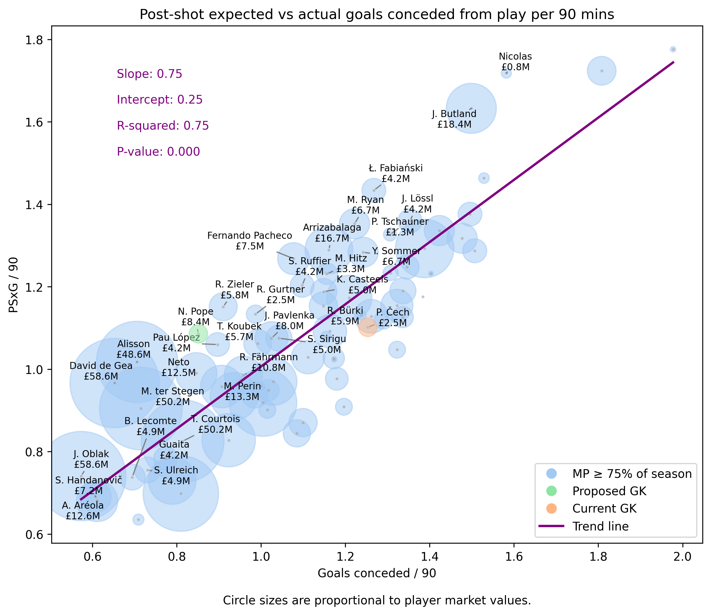
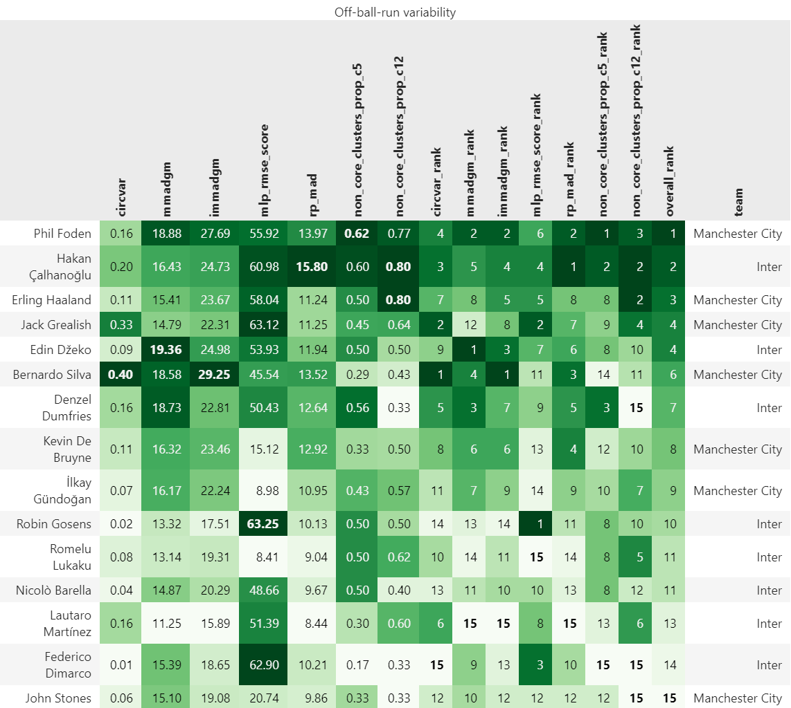

# Soccer Analytics Portfolio Sample

## Introduction

This sample of analyses consists of Jupyter notebooks and articles. The notebooks are structured such that there is a narrative &mdash; supplemented with plots &mdash; at the very top, and the code for analysing the data and producing the figures follows afterwards, in the same notebook.

## Soccermatics course assignments

The following are parts of analyses which were conducted in the form of solutions to assignments from the 2024 edition of the [Mathematical Modelling of Football](https://www.uu.se/en/study/course?query=1RT001) course (also known as [Soccermatics](https://soccermatics.readthedocs.io/)) offered by Uppsala University.

As a noteworthy side-note, as a result of my overall contributions and proactiveness &mdash; including but not limited to active participation during Zoom sessions and answering questions, helping and guiding fellow classmates on the dedicated Slack space for the course &mdash; I was the only student/participant who received a [special mention](https://www.linkedin.com/posts/pegah-rahimian-353053153_actions-speak-louder-than-goals-valuing-activity-7255590169972559873-yBbt/) in a LinkedIn post, indicating the conclusion of this year's edition of the course.

While I explored and prototyped a multitude of approaches when thinking about and attempting solutions to the tasks, not all of them could be included in the corresponding submissions due to guidelines pertaining to deliverable lengths. Ultimately, my submissions to the course assignments are effectively summarised in the referenced Jupyter notebooks.

### Lamine Yamal's UEFA Euro 2024 performance

Lamine Yamal's Euro 2024 performance is analysed in [`euro2024-statsbomb-yamal.ipynb`](statsbomb-yamal-euro2024/euro2024-statsbomb-yamal.ipynb). Particularly, the analysis focuses on his expected threat (_xT_) actions and areas, shots and actions per 90 minutes of playing time relative to the overall distribution of such actions across all players with a recorded minimum of 360 minutes of playing time. The corresponding dataset utilised for the analysis is StatsBomb's [open data](https://github.com/statsbomb/open-data) repository &mdash; particularly, event data from Men's Euro 2024 competition.

 top 10 players, in terms of each action type; as well as outlier -- i.e., overperformer -- regions, as identified by the employed outlier detection methods, namely (ii) interquartile range ($IQR$) and (iii) modified Chebyshev's inequality ($\hat{CI}$). Yamal's position and rank are annotated on each sub-plot.")

### Scouting for a GK transfer target for Arsenal in summer 2018

> [!NOTE]
> The code for this notebook is in the process of being refined and will be uploaded shortly.

The analysis in [`arsenal-summer-2018-gk.ipynb`](wyscout-top5-leagues-2017-2018/arsenal-summer-2018-gk.ipynb) is concerned with finding possible Arsenal transfer targets for the goalkeeper position, from the perspective of the beginning of summer 2018. It is conducted with respect to Wyscout [event data](https://figshare.com/collections/Soccer_match_event_dataset/4415000/5) for the top 5 leagues from 2017/2018.

### Variability of off-ball runs

The analysis presented in [`off-ball-runs.ipynb`](off-ball-runs-uefa-cl-final-2023/off-ball-runs.ipynb) is concerned with coming up with creative metrics to measure the variability of off-ball runs ending in the final third of the pitch during the respective player's own team's possessions. It utilises partial tracking data fron the UEFA Champions League 2022/2023 Final match between Manchester City and Inter.

## Other analyses

### Fantasy Premier League 2024/2025 pre-season analysis

> [!NOTE]
> The code for the dashboard is in the process of being refined and will be uploaded shortly.

This is an example of a recent analysis I performed as a side project for fun, with the intention to eventually share it with the world, after a bit more polishing. It is a Streamlit app which enables flexible visualisaions of Fantasy Premier League summary data.

### Fantasy Premier League 2016/2017 analysis

Exploring player statistics and analysis of conversion of playing-time to fantasy points for the Fantasy Premier League [2016/2017 season](https://hristog.github.io/tagged/fantasy-football/).
